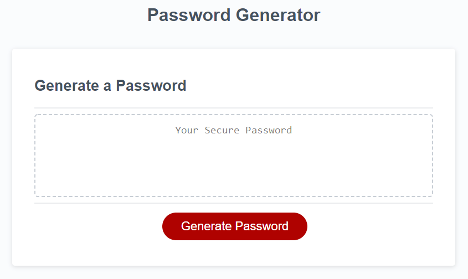

<h1 align="center">Javascript-Password-Generator Weekly Challenge 2 </h1>

Project User Story:AS AN employee with access to sensitive data
I WANT to randomly generate a password that meets certain criteria
SO THAT I can create a strong password that provides greater security

## Links

<a href="https://jessiferizzo.github.io/Javascript-Password-Generator/">Password Generator Site</a>

## Screenshots

## Built With

- JavaScript
- HTML
- CSS

## Author

**Jessica Sisavath**

- [Profile]()
- [Email](mailto:jsisavath@gmail?subject=Hi "Hi!")

## 🤝 Support

Contributions, issues, and feature requests are welcome!

Give a ⭐️ if you like this project!
